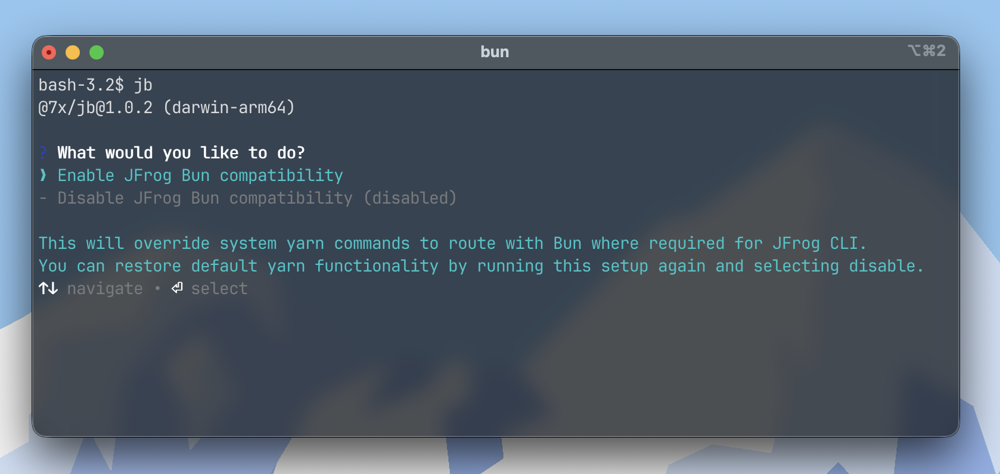

<h1 align="center">
  jb (jfrog-bun)
</h1>

<p align="center">
  Yarn wrapper to provide functionality for a subset of <a href="https://bun.com/">Bun</a> package manager commands in JFrog CLI with build info collection support.
</p>

<div align="center">
  <p>
    🌐 Usable in any environment including CI
    <br />
    🚀 Lightning fast builds and accurate build info collection
    <br />
    ❌ No patching of JFrog CLI client required
    <br />
    📚 Catalog & workspace support
    <br />
  </p>
</div>

<p align="center">
  <a href="https://github.com/aid7n/jb/actions/workflows/ci.yml">
    
  </a>
  <a href="https://npmjs.com/@7x/jb">
    
  </a>
  <a href="https://npmjs.com/@7x/jb-core">
    
  </a>
  <a>
    
  </a>
  <a href="https://github.com/aid7n/jb?tab=MIT-1-ov-file">
    
  </a>
</p>

<div align="center">
  
</div>

---

> **⚠️ Yarn users:** This tool **will** override functionality of any installed `yarn` instances on your system when JB is enabled. While it's possible to use the JB CLI to disable/revert back to the previously installed Yarn binaries after usage, it's generally not recommended to rely on this being 100% successful. If you require Yarn for any real reason, you should use with caution if running in your main development environment.

## Installation

```bash
# install jb globally
bun install -g @7x/jb

# launch the interactive menu
jb

# enable jb from commandline
jb enable

# disable jb from commandline
jb disable
```

After enabling JB, any supported `yarn` commands, both inside & outside the JF CLI, will be intercepted by JB to work natively with Bun.

## Supported platforms

Currently, the supported platforms and architectures for JB are as follows:

| Platform | Architecture  |
| -------- | ------------- |
| `darwin` | `x64` `arm64` |
| `linux`  | `x64` `arm64` |
| `win32`  | `x64` `arm64` |

## Usage

In your code repository, once JB has been enabled via the CLI, you can begin using it immediately. This will allow you to benefit from the speed of Bun's package installations, while simultaneously allowing you to stay compliant and collect all data about your dependencies for JFrog build info.

As JB is intended to provide native Bun support to the JFrog CLI via the Yarn implementation, you will have to configure your repository to use your Artifactory instance as the main package registry. You can do this via environment variables or via a `bunfig.toml` configuration; [see here]("https://bun.com/docs/guides/install/jfrog-artifactory#using-bun-install-with-artifactory") for more information on how to get set up.

To use via the JFrog CLI, you will also have to configure Yarn in your repository via `jf yarn-config` - see the [JFrog docs]("https://docs.jfrog.com/artifactory/docs/jf-yarn") on JFrog Yarn for more information on how to get set up. Though this will not be used nor is it required by JB, it is required by the JFrog CLI.

> ⚠️ Without a valid Artifactory registry URL set at runtime, the JB Yarn executable will immediately error on load, causing any commands to exit with code 1. This is to prevent malicious usage of this implementation.

Current support for Yarn commands via JB are as follows:

| Yarn command            | Expected behavior                                                                                               |
| ----------------------- | --------------------------------------------------------------------------------------------------------------- |
| `yarn install`          | Forwarded to `bun install` with the same arguments                                                              |
| `yarn info <...>`       | Parses `bun.lock` and outputs the equivalent of `yarn info --all --recursive --json`                            |
| `yarn config get <...>` | Returns `{}` - we have no need to adjust Bun's config                                                           |
| `yarn config set <...>` | Outputs nothing - no output is required on a successful config set                                              |
| `yarn --version`        | Outputs `3.0.0` by default, overridable by environment variable. JF CLI only requires this to satisfy `>2.4.0`. |

If there are needs for other commands, feel free to contribute via PR or raise a GitHub issue.

## How it works/why

JB works by wrapping itself around the functionality that the existing Yarn support in JFrog CLI provides and forwarding the commands on to equivalent Bun commands while satisfying the outputs that the CLI expects.

For example, when running `jf yarn install --build-name=<name> --build-number=<number>`, JFrog CLI invokes several `yarn` commands in the background using the Yarn client installed to your system, and parses their outputs accordingly to collect build information from start to finish. These specific required outputs are intercepted and passed into JB, spitting them back out to the JFrog CLI in a familiar and accurate output.

Depending on your project setup, using Bun instead of Yarn can result in **huge** improvements in project install times.

## CI

For CI workflows, you can easily get set up; in the case of a Bun repository with a `bunfig.toml` at the root that looks like so:

```toml
[install]
registry = { url = "$ARTIFACTORY_URL", token = "$ARTIFACTORY_TOKEN" }
```

A matching GitHub Actions workflow could look something like:

```yaml
name: CI
on:
  pull_request:
    branches:
      - main
    types:
      - opened
      - synchronize
      - reopened

jobs:
  ci:
    name: CI
    runs-on: ubuntu-latest
    steps:
      - name: Checkout
        uses: actions/checkout@v7

      - name: Setup Bun
        uses: oven-sh/setup-bun@v2

      - name: Setup JFrog CLI
        uses: jfrog/setup-jfrog-cli@v5
        env:
          JF_GIT_TOKEN: ${{ secrets.GITHUB_TOKEN }}
          JF_URL: ${{ vars.ARTIFACTORY_URL }}
          JF_PROJECT: ${{ vars.ARTIFACTORY_PROJECT }}
          JF_USER: ${{ secrets.ARTIFACTORY_USERNAME }}
          JF_PASSWORD: ${{ secrets.ARTIFACTORY_PASSWORD }}

      - name: Configure JFrog Yarn
        run: jf yarn-config --repo-resolve=<npm_repo_here>

      - name: Install Dependencies
        env:
          ARTIFACTORY_URL: ${{ secrets.NPM_ARTIFACTORY_URL }}
          ARTIFACTORY_TOKEN: ${{ secrets.NPM_ARTIFACTORY_TOKEN }}
          JB_WRITE_CATALOG_FIXES: true
        run: |
          # first enable jb
          bun install -g @7x/jb
          jb enable

          # then install deps with jf yarn
          jf yarn install \
            --frozen-lockfile \
            --build-name=${{ github.event.repository.name }} \
            --build-number=${{ github.run_number }}

      # .....

      - name: Publish build info
        run: |
          jf rt bp \
            ${{ github.event.repository_name }} \
            ${{ github.run_number }}

      - name: JFrog Xray
        run: |
          jf bs \
            ${{ github.event.repository_name }} \
            ${{ github.run_number }}
```

## Development/building

```bash
# clone the repo and install deps
git clone https://github.com/aid7n/jb.git
cd jb
bun install

# develop/watch
bun dev

# building/executing
bun run build
```

## Configuration

The app works on its own by default (with the exception of needing an Artifactory registry configured), however you are able to configure some default behaviors via env variables:

| Environment Variable     | Type      | Default | Values                     | Description                                               |
| ------------------------ | --------- | ------- | -------------------------- | --------------------------------------------------------- |
| `JB_LOGS_ENABLED`        | `boolean` | `true`  | `true` `false`             | Enables logging to ./jfrog-bun.log                        |
| `JB_SIMULATE_VERSION`    | `string`  | `3.0.0` | `<any valid semver value>` | Choose which Yarn version to simulate for JF CLI          |
| `JB_WRITE_CATALOG_FIXES` | `boolean` | `false` | `true` `false`             | Write catalog resolutions to workspace package.json files |

## Disclaimer

This project is not affiliated with Bun, Yarn nor JFrog. The software has been created solely for the purposes of providing additional functionality to the JFrog CLI.

## Contact

For any questions or suggestions, feel free to reach out via GitHub issues.

## License

This project is licensed under the MIT license. See the [LICENSE]("https://github.com/aid7n/jb?tab=MIT-1-ov-file") file for more details.
